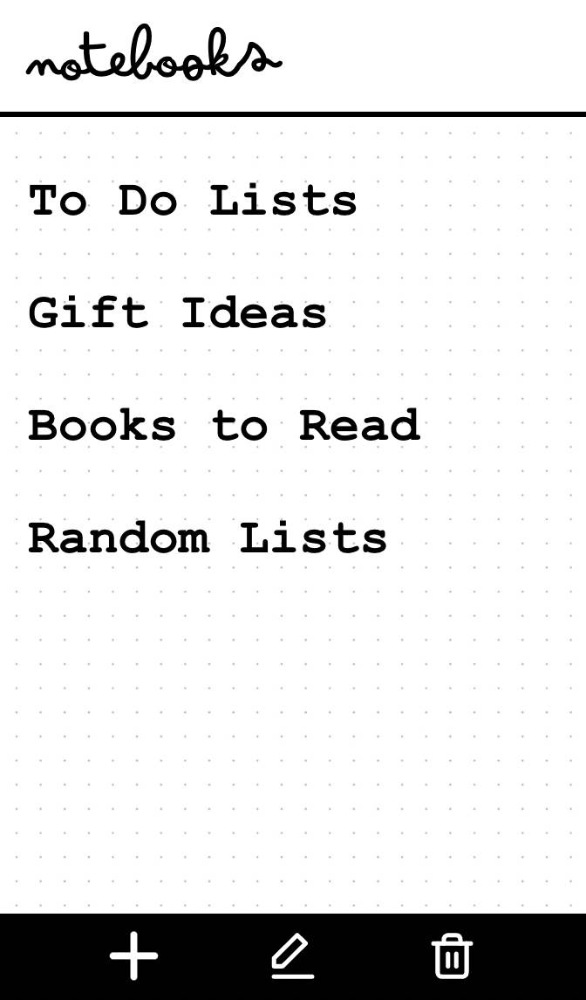
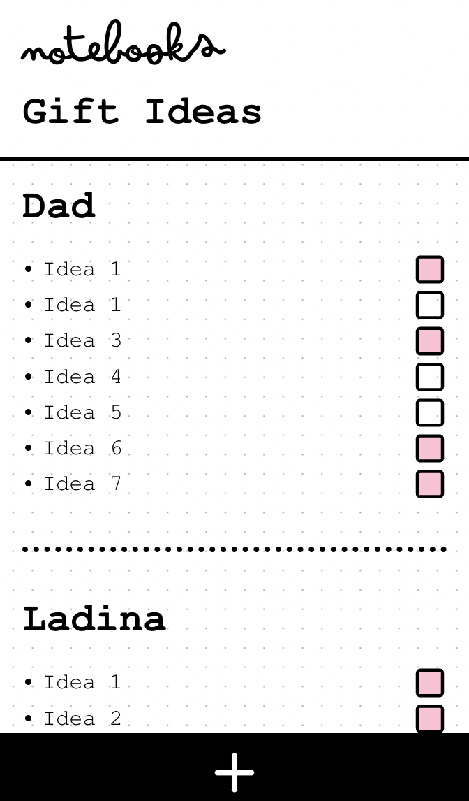
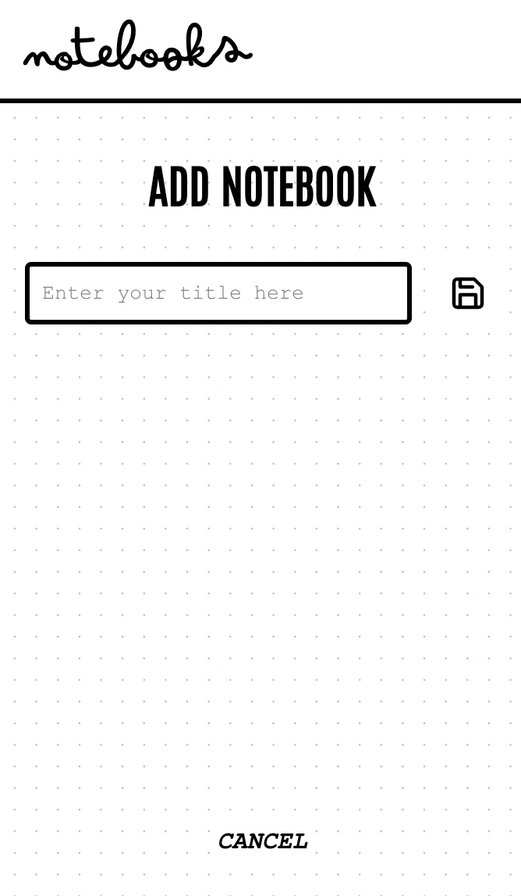

# Overview: Notebooks

- A journalling app
- Leaning on the concepts of physical notebooks and blog entries
- Journals are sorted into notebooks
- Each notebook represents a year. App is inteded to be expanded to contain more entry types, see nice to haves.

### Problem

Physical journals take up space and are time consuming to maintain. A journal on your phone can be udpated quickly, on the go, and doesn't use any extra space in your bag or bookshelf.

### User Profile

Anyone who would like to use journalling to improve their mental health or enjoys browsing through old memories

### Features

#### Home

- Logo
- List navigation to all notebooks available
- Option to create new notebook

#### Navigations

- Navigation at top shows you where you are (notebook title | journal title | journal entry title). The titles are clickable.
- Navigation at bottom, only shows icons that apply (or greys out other ones)
  - back and forward arrows
  - add icon
  - edit icon
  - double arrow up: collapses all entries so only titles are visible and reverse

#### Notebooks

- Entries are displayed as endless scroll, like blog posts
- Displays entries from all journals
- As default sorted by date, newest on top
- You can collapse all entries and only see the titles
- Each notebook has a creation date

#### Journals

- Are sorted into notebooks
- Consist of entries
- Each journal has a creation date

#### Entries

- Can contain text, images, or links
- Each entry has a creation date

## Implementation

### Tech Stack

- Use HTML, CSS, SASS/BEM, JavaScript, React, Node, Express, Knex.js, Databases, GitHub
- I may use trix as a text editor npm package for the journal entries
- I may use a date picker npm package for the user to select a creation date for notebooks/journals/journal entries.

### APIs

The data will come from the user and I will build the database structure to save the data with knex.js.

### Sitemap

#### /

- Home page with list of all notebooks as links

#### /notebooks/:notebook-id

- Page of all posts from one notebook in blog post format, sorted by date, newest at top. All posts can be collapsed so only header is visible.

#### /notebooks/:notebook-id/journals/:journal-id

- Page of all entries from one journal in one notebook in blog format

#### /notebooks/:notebook-id/journals/:journal-id/:journal-entry-id

- Page of one specific journal entry in a notebook

#### /create-notebook

- Create notebook page

#### /notebooks/:notebook-id/create/journal

#### /notebooks/:notebook-id/create/journal-entry

- Page to create a journal/journal entry in one notebook

### Mockups








### Data

The data will be what the user inputs.


### Endpoints

#### http://localhost:8080/api/notebooks

- To get a list of all notebooks, post notebooks, edit notebooks or delete notebooks
- GET / POST / PUT / DELETE

```
[
 {
    "id": 1,
    "date": "11/13/2023, 3:30:00 PM",
    "title": "2023"
 }
]
```

#### http://localhost:8080/api/journals

- to get a list of all journals, add a new journal, edit a journal or delete a journal
- GET / POST / PUT / DELETE

```
[
  {
    "id": 1,
    "date": "11/13/2023, 3:30:00 PM",
    "title": "Gratitude",
    "notebook_id": "1"
  }
]
```

#### http://localhost:8080/api/entries

- to get a list of all entries, add a new entry, edit an entry or delete an entry
- GET / POST / PUT / DELETE

```
      {
        "id": 1,
        "date": "11/13/2023, 3:30:00 PM",
        "title": "17 Nov",
        "text": "This is a journal entry. There are many variations of passages of Lorem Ipsum available, but the majority have suffered alteration in some form, by injected humour, or randomised words which don't look even slightly believable. If you are going to use a passage of Lorem Ipsum, you need to be sure there isn't anything embarrassing hidden in the middle of text.",
        journal_id: 3,
      };
```

### Auth

I would like to add log-in functinality in the future, but not for this sprint.

## Roadmap

### 13 Nov

Proposal first draft

### 14 Nov

- Finalise proposal
- Create some seed data for
  - http://localhost:8080/api/notebooks
  - http://localhost:8080/api/journals
  - http://localhost:8080/api/entries

### 15 Nov

- Set up API end-points on back-end, see above
- Set up pages and routes on front-end

### 16 Nov

- Header component (logo with link, background, border-bottom)
- Home page component with list of notebook titles as links
- Footer navigation component all 5 icons. Icons in state so they’re only displayed when needed?

### 7 Nov

- Industry project
- Navigation component. Displays what page you’re on. Chevron on right to get dropdown menu

### 18 Nov

- Dropdown menu component. Expandable sections populated with titles. Links.
- Create list component

### 19 Nov

- Create add notebook component. Button sends POST request to API endpoint.
- Create page that shows all entries from one notebook

### 20 Nov

- Create page that shows all entries from a specific journal

### 21 Nov

- Create journal entry component

### 22 Nov

- Create add stuffs component. Link to each create page.

### 23 Nov

- Create add journal component

### 24 Nov

- Create add journal entry component

### 25/26 Nov

- Bug fixes and styling

## Nice-to-haves

### Overview

- App is extended to combine journals, lists and trackers
- Helps evaluate where you are in your life, makes you think about your goals and helps building healthy habits that will help you achieve these
- An archive of your life you can look back on to simply reminisce or to see how far you have come
- App helps you get started with suggestions where to start
  - Start with one notebook per year. In that:
  - Create a gratitude journal. Create a new page every day and write down three things you’re grateful for or proud of. Link to article of mental health benefits of doing this.
  - Create a list page and write down goals you would like to achieve. Think of habits you’d like to build and where you want to be in a year / 5 years. Link to article of how setting goals improves success rate.
  - Create a weekly habit tracker page for habits that will help you achieve your goals. Link to study of how long you need to do a habit so it becomes something that is done without having to think about it.
  - Create a to do list page
  - Start a mood tracker page every month to be able to see patterns in your moods
  - Suggest other things you can do
    - eg create a recipe collection (as a new notebook, use a journal for each theme such as mains, deserts, etc)
    - Create lists such as movies I'd like to watch, books to read, etc
- Can easily add pictures, screenshots, URLs to a page when browsing the internet or from pictures on phone
- Make it social so you can share aspects of it with friends who are using the app too
- Have option so you can export a notebook to PDF
- Priority: Search functions globally, per notebook, per journal, etc

### Functions

#### General

- title images for each page / section / notebook / month, dipslay optional

#### Home

- Ability to set your own colour scheme / chose own fonts
- Choose which libraries, notebooks, collections, or pages you want to display on homepage (tick option: show on homepage)

#### Notebooks

- Notebooks can be sorted into libraries
- Can have sections in it in which to sort the entries. Each section can have a header page
- Options of how to display several image on one page in endless scroll view
  Have four page categories:
  - Journals
  - Lists
  - Mood trackers
  - Habit trackers

#### Lists

- Individual list items who either
- Get crossed out when done
- Or have a tickbox next to them
- list items can be sorted under sub-titles
- Option to display on calendar or not
- If list/item has a date, option to send reminder to phone as alert
- Lists can have subtitles with groups of lists
- Optional due date per list or item
- In progress option for when do to is started (colour of tickbox?)
- can add images

#### Habits

- Weekly
- For each habit
  - Chose how many times per week you want to do that habit
  - Eg 4 x week will get you 4 circles next to that habit
  - Each time you do the habit that week you fill out one circle
  - Each habit has a start next to it as well which can be filled out when all circles have been completed that week
- Chose when you want to archive habit, eg after completing 4 weeks in a row. Once that’s done you get a message that you achieved it and it gets archived. You can see all archived habits that year.
- Can see habits in a calendar
- Nth: habits can be tracked weekly, monthly or yearly

#### Mood Tracker

- Monthly
- Header with month name at top
- Vertical list of days in month with date, weekends in different background colour
- You can add smilies in each day to track mood and other things

#### Add to Calendar Button (OR Nth: Calendar)

- Have a 'add to calendar' button where you can add to do lists to your device calendar
- Use npm library for this?

#### Calendar (OR Add to Calendar Button)

- Displayed like apple calendar
- Events on calendars are marked with an indicator (text? dots?)
- Clicking on a day shows you what’s on that day below the calendar
- Can insert item on a certain day
- Daily, weekly, monthly and yearly view
- Have calendars work as pages, so can build as many as you want to show different items, but have one main calendar with all the items in it
- Can have filter what’s showing up so can have an item with a calendar that shows all habits and a different item with a calendar that shows all to dos and a main calendar that has everything in it (can toggle on and off filters)
- Can repeat event daily/weekly/monthly/yearly
- Can set reminders for events
- Habits show up on calendar. Appear differently based on if you completed the habit or not, and if it’s in the future or past
- Can display when you wrote a journal entry and link to them (toggle on and off on main calendar)
- To dos appear on calendar. Different appearance for active to dos that are done and not

#### Libraries

- Are a collection of notebooks
- Can have a title image, or display collection of notebook title images/previews
- Show up in navigation or on homepage

#### Archive

- Same structure as usual page, but with all libraries/notebooks/ that are archived
- Have a date as to when they were originally created, and when they were archived
- Option to view notebooks with their pages as very small previews, sorted chronologically by date with month/year headers
- Lists can be archived so they don't show up in notebook scroll anymore

### Sitemap

#### /notebooks/:notebook-id/create/section

#### /notebooks/:notebook-id/create/mood-tracker

#### /notebooks/:notebook-id/create/habit-tracker

#### /notebooks/:notebook-id/create/list

#### /notebooks/:notebook-id/lists/:list-id

#### /notebooks/:notebook-id/mood-trackers/:mood-tracker-id

#### /notebooks/:notebook-id/habit-trackers/:habit-tracker-id

#### /notebooks/:notebook-id/habit-trackers

#### /notebooks/:notebook-id/mood-trackers

#### /notebooks/:notebook-id/lists

- Page of all mood trackers/habit trackers/lists from one notebook, as a collapsed navigation

#### /notebooks/:notebook-id/sections/:section-id

- Page of all journal entries/mood trackers/habit trackers/lists from one section in one notebook

### Data

The data will be what the user inputs.


### Endpoints

#### http://localhost:8080/api/sections

- to get a list of all sections, add a section, edit a section or delete a section
- GET / POST / PUT / DELETE

```
[
  {
     "id": 1,
     "date": "11/13/2023, 3:30:00 PM",
     "title": "17 Nov",
     "notebook_id": "3"
   }
]
```

#### http://localhost:8080/api/mood-trackers

- to get a list of all mood-trackers, get one specific mood-tracker, add a new mood-tracker, edit a mood-tracker or delete a mood-tracker
- GET / POST / PUT / DELETE

```
[
  {
     "id": 1,
     "date": "11/13/2023, 3:30:00 PM",
     "title": "April",
     "notbooke_id": "5",
     "mood_month": "November",

   }
]
```

#### http://localhost:8080/api/mood-days

- to get days or edit a days
- GET / PUT

```
[
  {
    "day_nr": 1,
    "day_weekend": true,
    "day_content": "U+1F600",
    "day_notes": "Some more info about day1.",
  },
  // etc, for each day of the "mood_month"...
];
```

#### http://localhost:8080/api/habit-trackers

- To get a list of all habit-trackers, add a new habit-tracker, edit a habit-tracker or delete a habit-tracker
- GET / POST / PUT / DELETE

```
[
  {
    "id": 1,
    "date": "11/13/2023, 3:30:00 PM",
    "title": "WC 5 November",
    "notebook_id": "5",
    "section_id": "4",
  },
];
```

#### http://localhost:8080/api/habits

- To access data of habits, add a new habit, edit a habit or delete a habit
- GET / POST / PUT / DELETE

```
[
  {
    "id": 1,
    "order": 1,
    "title": "go for a run",
    "amount_per_week": 2,
    "habit_tracker_id": 1
  }
]
```

#### http://localhost:8080/api/circles

- To access data of the circles of each habit (GET), set the amoung of circles (POST), edit the "done" status of a circle (true or false)
- amount of circles per habit depends on what is set in the habit as "amount_per_week"

```
[
  {
    "id": 1,
    "done": true,
    "habit_id": 1,
  }
]
```

#### http://localhost:8080/api/lists

- To get a list of lists, get one list, add a new list edit a list or delete a list
- GET / POST / PUT / DELETE

```
[
  {
    id: 1,
    date: "11/13/2023, 3:30:00 PM",
    title: "To Do Today",
    section_id: "4",
    notebook_id: "5",
  }
]
```

#### http://localhost:8080/api/list-items

- To get a list of all list items for a specific list, add a new list item, edit a list item or delete a list item
- GET / POST / PUT / DELETE

```
      {
        "id": 1,
        "text": "call dad",
        "tick-or-strike": true,
        "done": true,
        "list_id": 3
      }
```
